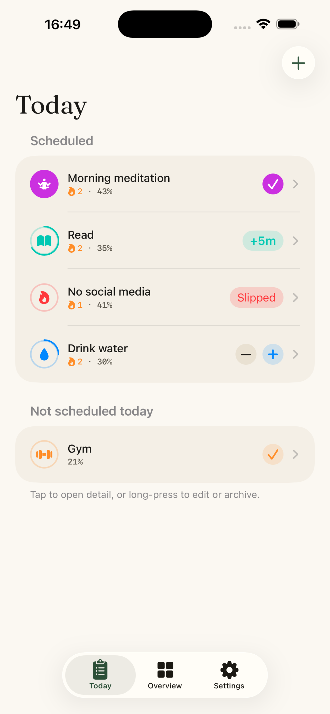
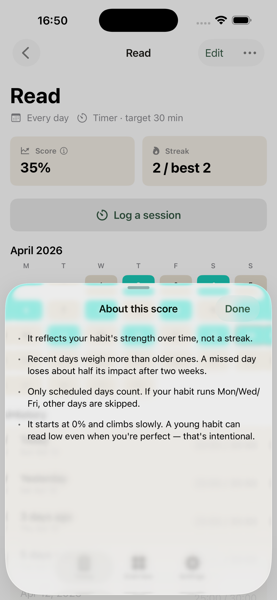
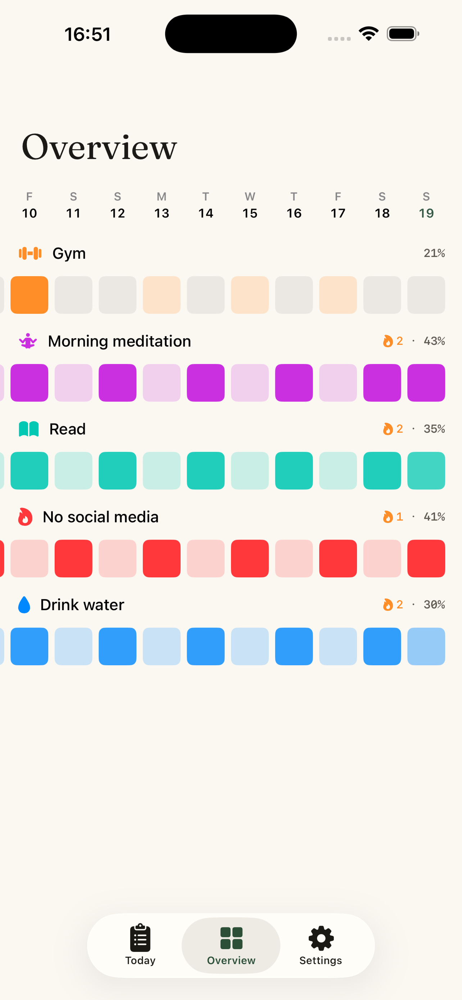
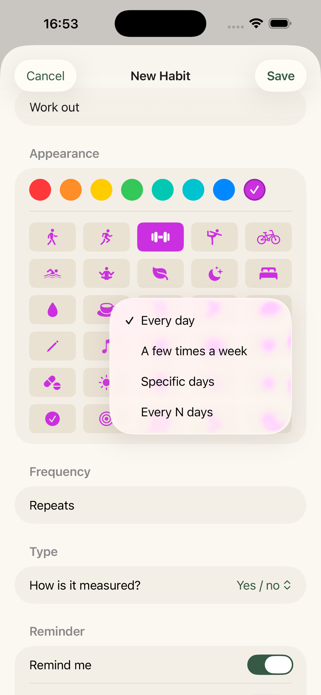
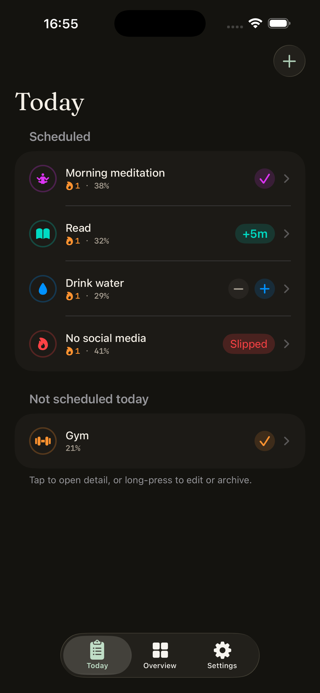

<div align="center">
  <a href="https://getkado.app/"></a>

  <p><strong>A privacy-first habit tracker for iPhone and iPad.</strong></p>
  <p>
    Non-binary habit score · Offline-first · Open source (MIT) ·
    No account, no subscription, no telemetry.
  </p>

  <p>
    <a href="https://apps.apple.com/app/id6762570244"></a>
  </p>
  <p>
    <a href="https://getkado.app/">getkado.app</a>
  </p>

  <p>
    <a href="https://github.com/scastiel/kado/blob/main/LICENSE"></a>
    <a href="https://developer.apple.com/swift/"></a>
    
  </p>
</div>

---

## What is Kadō?

Kadō is an iOS habit tracker with three commitments:

1. **A score, not a streak.** The habit score — inspired by
   [Loop Habit Tracker](https://github.com/iSoron/uhabits) on Android —
   is a non-binary exponential moving average of your completions.
   One missed day doesn't wipe your progress. You see a trend, not a
   fragile chain.
2. **Your data stays yours.** No account, no analytics, no third-party
   SDKs. Storage is local (SwiftData), sync is optional through your
   own iCloud (CloudKit private database). See [`PRIVACY.md`](./PRIVACY.md).
3. **Native to Apple.** SwiftUI, `@Observable`, SwiftData, CloudKit,
   WidgetKit, App Intents — no cross-platform layer, no third-party
   dependencies.

Why another habit tracker? The market gap is spelled out in
[`docs/PRODUCT.md`](./docs/PRODUCT.md): the reference open-source
tracker (Loop) is Android-only; the reference iOS tracker (Streaks)
is closed source and uses a binary streak; the most visible modern
iOS open source attempt (Teymia) is freemium and ships without Apple
Watch or HealthKit. Kadō takes Loop's algorithm to native iOS, MIT,
with the full Apple ecosystem in scope.

## Screenshots

<p float="left">
  
  
  
  
  
</p>

## Features

- **Today view** — habits due today, tap to complete, long-press for
  partial / note / timer.
- **Habit detail** — monthly calendar, current streak, best streak,
  habit score with an info popover explaining the math.
- **Overview** — habits × days matrix with score-shaded cells, the
  Loop / Way of Life pattern with Kadō's score DNA.
- **Flexible schedules** — daily, N days per week, specific weekdays,
  every N days. Binary, counter, or timer habit types.
- **Widgets** — Home Screen (small / medium / large) and Lock Screen
  (rectangular / circular / inline). Quick-complete via `AppIntent`.
- **Reminders** — per-habit local notifications with recurring
  schedules and check / skip quick actions.
- **iCloud sync** — optional, opt-in, goes only through the user's
  private CloudKit database.
- **JSON export / import** — lossless backup of your data; round-trip
  tested. CSV (export, generic import, Loop import) is a post-v0.2
  follow-up.
- **Accessibility** — Dynamic Type up to XXXL, VoiceOver labels on
  every surface, full Dark Mode.
- **Localization** — English and native French (not machine-translated).

## Status

- **v0.1 MVP** — shipped.
- **v0.2 "Visible iOS-native"** — shipped (widgets, overview,
  notifications, JSON import/export, CloudKit polish).
- **App Store** — first public build submitted, currently in review.
  TestFlight external beta is live.
- **Next** — v0.3: App Intents / Siri, HealthKit auto-completion,
  Live Activities + Dynamic Island, native Apple Watch app.

Full roadmap in [`docs/ROADMAP.md`](./docs/ROADMAP.md).

## Tech stack

- **SwiftUI** with `@Observable` (iOS 17+) for state — no Combine.
- **SwiftData** for local persistence, with `VersionedSchema` +
  `SchemaMigrationPlan` wired from day one.
- **CloudKit** via SwiftData (`cloudKitDatabase: .private(...)`) for
  multi-device sync.
- **WidgetKit** + an App Group JSON snapshot for extension surfaces
  (the widget process never opens SwiftData — see `CLAUDE.md` for
  why).
- **App Intents** for widget quick-complete today; Siri / Shortcuts
  arrive in v0.3.
- **Swift Testing** for unit tests, XCTest for UI tests.
- **Zero third-party dependencies.**

Target: iOS 18.0+, Xcode 16.0+, Swift 5.10+.

Architecture notes, conventions, and toolchain quirks (SwiftData
edge cases, CloudKit-shape rules, concurrency under Swift 6, etc.)
are documented in [`CLAUDE.md`](./CLAUDE.md).

## Repository layout

```
Kado/                       # Main iOS app target
Packages/KadoCore/          # Shared Swift package — @Model types,
                            #   domain types, calculators, intents,
                            #   widget snapshot types
KadoWidgets/                # Widget extension target (reads an
                            #   App Group JSON snapshot)
KadoTests/                  # Unit tests (Swift Testing)
branding/                   # SVG marks and wordmarks
docs/
├── PRODUCT.md              # Product vision, competitive analysis
├── ROADMAP.md              # Versioned feature roadmap
├── habit-score.md          # Score algorithm spec
├── streak.md               # Streak algorithm spec
├── app-store-connect.md    # Store metadata, copy, checklists
├── plans/                  # Per-feature research / plan / compound
│                           #   artifacts from the conductor workflow
└── screenshots/            # iPhone 6.7" and iPad 13" sets (EN + FR)
PRIVACY.md                  # Privacy policy (repo-hosted)
```

## Development

### Requirements

- macOS 14.5+
- Xcode 16.x+
- An Apple Developer account is only needed to build to a physical
  device or TestFlight; the simulator does not require one.

### Build and run

```bash
git clone https://github.com/scastiel/kado.git
cd kado
open Kado.xcodeproj
```

Select the `Kado` scheme and an iOS 18 simulator (iPhone 17 Pro is
the project's practical default on Xcode 26 toolchains).

### Tests

From Xcode: `⌘U` on the `Kado` scheme.

From the command line via `xcodebuild`:

```bash
xcodebuild -project Kado.xcodeproj -scheme Kado \
  -destination "platform=iOS Simulator,name=iPhone 17 Pro" \
  test
```

If you use Claude Code with the
[XcodeBuildMCP](https://github.com/getsentry/XcodeBuildMCP) server,
prefer `test_sim` / `build_sim` over shell `xcodebuild` — see the
"Tooling" section of `CLAUDE.md`.

### Dev mode

Settings has a hidden dev-mode toggle that swaps the SwiftData
container for a seeded local sandbox. Useful for playing with
historical score / streak behavior without affecting your real data.
See `docs/plans/2026-04/dev-mode/` for the design notes.

## Contributing

Issues and pull requests are welcome. A few notes:

- Read [`CLAUDE.md`](./CLAUDE.md) first — it is the project's working
  agreement (architecture, conventions, testing expectations,
  toolchain quirks). It is written for Claude Code but applies
  equally to human contributors.
- Business logic (score, streak, frequency, import/export) is
  test-first. New behavior needs a test; regressions need a test
  that would have caught them.
- One PR per feature or logical fix. Commit message format follows
  a lightweight Conventional Commits convention —
  `feat(scope): description`, `fix(scope): …`, etc.
- No third-party dependencies in v0.x. If RevenueCat becomes
  necessary for a Pro tier later it will be the only exception.

## Privacy

Kadō collects nothing. No analytics, no telemetry, no crash reporter.
iCloud sync is optional and goes through the user's own private
CloudKit database.

Full policy in [`PRIVACY.md`](./PRIVACY.md).

## License

[MIT](./LICENSE) © 2026 Sébastien Castiel.

## Acknowledgements

- **[Loop Habit Tracker](https://github.com/iSoron/uhabits)** (Álinson
  S. Xavier, GPLv3) — the source of the non-binary habit score
  algorithm. Kadō reimplements the idea natively in Swift; no Loop
  code was copied.
- **[Streaks](https://streaksapp.com/)** (Crunchy Bagel) — the iOS
  UX reference for how this kind of app should feel.
- **[Teymia Habit](https://github.com/amanbayserkeev0377/teymia-habit)**
  (MIT) — reference point for a modern SwiftUI + SwiftData +
  CloudKit + WidgetKit stack on iOS.
- **[XcodeBuildMCP](https://github.com/getsentry/XcodeBuildMCP)**
  (getsentry, MIT) — the MCP server that makes an autonomous
  build / test / screenshot loop possible with Claude Code.
