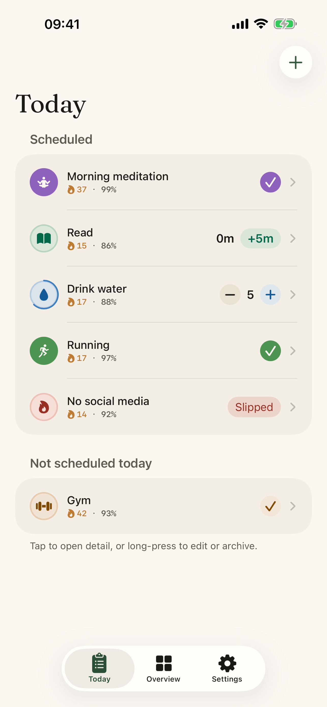
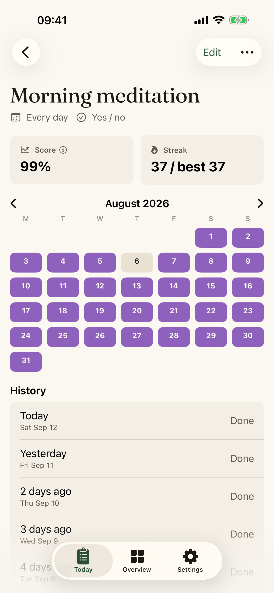
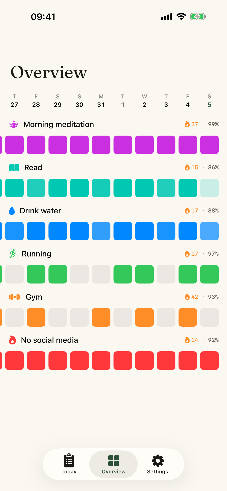
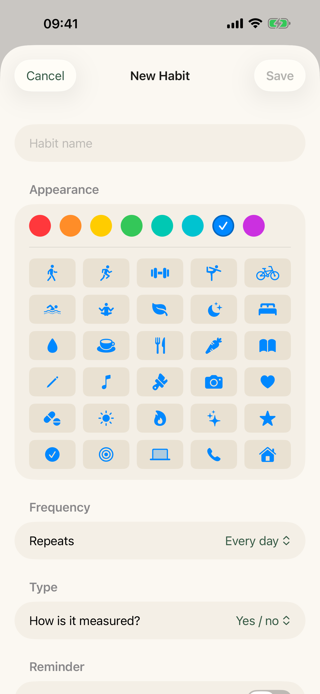
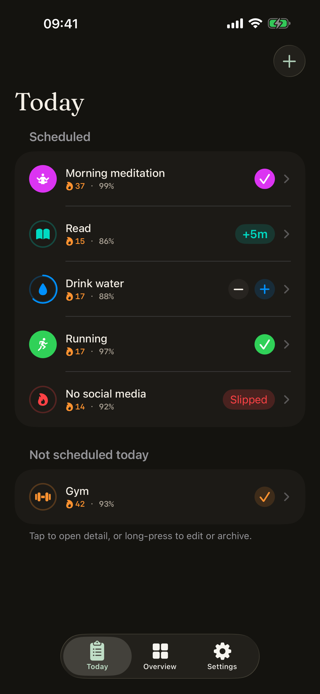

<div align="center">
  <a href="https://getkado.app/"></a>

  <p><strong>A privacy-first habit tracker for iPhone and iPad.</strong></p>
  <p>
    Non-binary habit score · Offline-first · Open source (MIT) ·
    No account, no subscription, no telemetry.
  </p>

  <p>
    <a href="https://apps.apple.com/app/id6762570244"><picture><source media="(prefers-color-scheme: dark)" srcset="https://getkado.app/assets/branding/app-store-en-white.svg" /></picture></a>
  </p>
  <p>
    <a href="https://getkado.app/">getkado.app</a>
  </p>

  <p>
    <a href="https://github.com/scastiel/kado/blob/main/LICENSE"></a>
    <a href="https://apps.apple.com/app/id6762570244"></a>
    <a href="https://developer.apple.com/swift/"></a>
    
  </p>
</div>

---

## What is Kadō?

Kadō is an iOS habit tracker with three commitments:

1. **A score, not a streak.** The habit score — inspired by
   [Loop Habit Tracker](https://github.com/iSoron/uhabits) on Android —
   is a non-binary exponential moving average of your completions.
   One missed day doesn't wipe your progress. You see a trend, not a
   fragile chain.
2. **Your data stays yours.** No account, no analytics, no third-party
   SDKs. Storage is local (SwiftData), sync is optional through your
   own iCloud (CloudKit private database). Export is lossless, in JSON
   or CSV, whenever you want it. See [`PRIVACY.md`](./PRIVACY.md).
3. **Native to Apple.** SwiftUI, `@Observable`, SwiftData, CloudKit,
   WidgetKit, App Intents — no cross-platform layer, no third-party
   dependencies.

Why another habit tracker? The market gap is spelled out in
[`docs/PRODUCT.md`](./docs/PRODUCT.md): the reference open-source
tracker (Loop) is Android-only; the reference iOS tracker (Streaks)
is closed source and uses a binary streak; the most visible modern
iOS open source attempt (Teymia) is freemium. Kadō takes Loop's
algorithm to native iOS — MIT, free, no account, no subscription.

## Screenshots

<p float="left">
  
  
  
  
  
</p>

## Features

- **Today view** — habits due today, tap to complete, long-press for
  partial / note / timer, drag to reorder (the order syncs via
  iCloud).
- **Habit detail** — monthly calendar with month-by-month navigation,
  current streak, best streak, habit score with an info popover
  explaining the math. Edit any past day straight from the calendar,
  including days before the habit existed.
- **Per-day notes** — a short note on any day's completion, carried
  through export and import.
- **Overview** — habits × days matrix with score-shaded cells, the
  Loop / Way of Life pattern with Kadō's score DNA. Completions logged
  off-schedule show up too, instead of hiding as rest days.
- **Flexible schedules** — daily, N days per week, specific weekdays,
  every N days (the cycle re-anchors on each completion, so finishing
  early never costs you a day). Binary, counter, or timer habit types.
- **Day starts at** — push the day rollover as late as 6 AM, so
  late-night logging still lands on the day you mean. Changing it
  never re-buckets history.
- **Widgets** — Home Screen (small / medium / large) and Lock Screen
  (rectangular / circular / inline). Quick-complete via `AppIntent`.
- **Siri and Shortcuts** — complete a habit, log a value, or ask for a
  score and streak, hands-free. Also available as Home Screen actions
  and Shortcuts automations.
- **Reminders** — per-habit local notifications with recurring
  schedules and check / skip quick actions.
- **iCloud sync** — optional, opt-in, goes only through the user's
  private CloudKit database. Settings shows live sync state, including
  when sync isn't working.
- **JSON and CSV export / import** — lossless backup of your data, in
  both formats, round-trip tested. Open a CSV backup in Numbers or
  Excel, edit it, bring it back in.
- **Tip Jar** — entirely optional, unlocks nothing. The whole app
  stays free, with no ads, no subscription, and no tracking.
- **Accessibility** — Dynamic Type up to XXXL, VoiceOver labels on
  every surface, full Dark Mode.
- **Localization** — English and native French (not machine-translated).

## Status

**Shipping on the App Store — [current version 1.7](https://apps.apple.com/app/id6762570244).**

| Version | Highlights |
|---|---|
| 1.0 | First public release — score, Today / Overview / Detail, widgets, iCloud sync, reminders, JSON export, EN + FR |
| 1.1 | Siri and Shortcuts; edit past days from the calendar |
| 1.2 | Per-day notes; backdated completions; month navigation |
| 1.3 | Drag to reorder habits; a gentle, one-time review prompt |
| 1.4 | iCloud sync reliability — iPad crash fix, honest sync status |
| 1.5 | Tip Jar (StoreKit 2), optional and unlocking nothing |
| 1.6 | "Day starts at" hour; days-per-week scoring fix; off-schedule completions in Overview |
| 1.7 | CSV export / import round-trip; "every N days" re-anchors on completion |

**Not planned.** A native Apple Watch app and HealthKit
auto-completion were scoped for v0.3 and have been **descoped** — no
user has asked for either since launch. Both stay listed in
[`docs/ROADMAP.md`](./docs/ROADMAP.md) under "Descoped", and would be
reconsidered on real demand.

**Next** — Live Activities and Dynamic Island for timer habits, then
the remaining v1.x polish (themes, biometrics, categories, backup
files). Full roadmap in [`docs/ROADMAP.md`](./docs/ROADMAP.md).

## Tech stack

- **SwiftUI** with `@Observable` (iOS 17+) for state — no Combine.
- **SwiftData** for local persistence, with `VersionedSchema` +
  `SchemaMigrationPlan` wired from day one.
- **CloudKit** via SwiftData (`cloudKitDatabase: .private(...)`) for
  multi-device sync.
- **WidgetKit** + an App Group JSON snapshot for extension surfaces
  (the widget process never opens SwiftData — see `CLAUDE.md` for
  why).
- **App Intents** for widget quick-complete, Siri, and Shortcuts.
- **StoreKit 2** for the Tip Jar.
- **Swift Testing** for unit tests, XCTest for UI tests and for the
  App Store screenshot run.
- **Zero third-party dependencies.**

Target: iOS 18.0+, Xcode 16.0+, Swift 5.10+.

Architecture notes, conventions, and toolchain quirks (SwiftData
edge cases, CloudKit-shape rules, concurrency under Swift 6, etc.)
are documented in [`CLAUDE.md`](./CLAUDE.md).

## Repository layout

```
Kado/                       # Main iOS app target
Packages/KadoCore/          # Shared Swift package — @Model types,
                            #   domain types, calculators, intents,
                            #   widget snapshot types
KadoWidgets/                # Widget extension target (reads an
                            #   App Group JSON snapshot)
KadoTests/                  # Unit tests (Swift Testing)
KadoUITests/                # UI tests (XCTest) + the App Store
                            #   screenshot run
Scripts/                    # Screenshot capture, framing, and the
                            #   dependency-free App Store Connect client
site/                       # getkado.app — static marketing site
branding/                   # SVG marks and wordmarks
docs/
├── PRODUCT.md              # Product vision, competitive analysis
├── ROADMAP.md              # Versioned feature roadmap
├── habit-score.md          # Score algorithm spec
├── streak.md               # Streak algorithm spec
├── app-store/              # Listing copy, captures, framed images,
│                           #   and how they are pushed
├── app-store-connect.md    # Store metadata, copy, checklists
├── plans/                  # Per-feature research / plan / compound
│                           #   artifacts from the conductor workflow
└── screenshots/            # iPhone 6.7" set (EN + FR), also the
                            #   source for the marketing site
PRIVACY.md                  # Privacy policy (repo-hosted)
```

## Development

### Requirements

- macOS 14.5+
- Xcode 16.x+
- An Apple Developer account is only needed to build to a physical
  device or TestFlight; the simulator does not require one.

### Build and run

```bash
git clone https://github.com/scastiel/kado.git
cd kado
open Kado.xcodeproj
```

Select the `Kado` scheme and an iOS 18 simulator (iPhone 17 Pro is
the project's practical default on Xcode 26 toolchains).

### Tests

From Xcode: `⌘U` on the `Kado` scheme.

From the command line, the `Makefile` wraps the common loops:

```bash
make test    # unit suite (Swift Testing) — a couple of seconds
make e2e     # UI suite (XCUITest), minus the screenshot run
make build   # compile the app for the simulator
```

`make help` lists the rest, including the App Store targets
(`make screenshots`, `make frames`, `make listing`) documented in
[`docs/app-store/README.md`](./docs/app-store/README.md).

If you use Claude Code with the
[XcodeBuildMCP](https://github.com/getsentry/XcodeBuildMCP) server,
prefer `test_sim` / `build_sim` over shell `xcodebuild` — see the
"Tooling" section of `CLAUDE.md`.

### Dev mode

Settings has a hidden dev-mode toggle that swaps the SwiftData
container for a seeded local sandbox. Useful for playing with
historical score / streak behavior without affecting your real data.
See `docs/plans/2026-04/dev-mode/` for the design notes.

## Contributing

Issues and pull requests are welcome. A few notes:

- Read [`CLAUDE.md`](./CLAUDE.md) first — it is the project's working
  agreement (architecture, conventions, testing expectations,
  toolchain quirks). It is written for Claude Code but applies
  equally to human contributors.
- Business logic (score, streak, frequency, import/export) is
  test-first. New behavior needs a test; regressions need a test
  that would have caught them.
- One PR per feature or logical fix. Commit message format follows
  a lightweight Conventional Commits convention —
  `feat(scope): description`, `fix(scope): …`, etc.
- No third-party dependencies. The Tip Jar is built directly on
  StoreKit 2, and the App Store Connect client in `Scripts/` signs
  its own JWT with `openssl`, precisely so that stays true.

## Privacy

Kadō collects nothing. No analytics, no telemetry, no crash reporter.
iCloud sync is optional and goes through the user's own private
CloudKit database.

Full policy in [`PRIVACY.md`](./PRIVACY.md).

## License

[MIT](./LICENSE) © 2026 Sébastien Castiel.

## Acknowledgements

- **[Loop Habit Tracker](https://github.com/iSoron/uhabits)** (Álinson
  S. Xavier, GPLv3) — the source of the non-binary habit score
  algorithm. Kadō reimplements the idea natively in Swift; no Loop
  code was copied.
- **[Streaks](https://streaksapp.com/)** (Crunchy Bagel) — the iOS
  UX reference for how this kind of app should feel.
- **[Teymia Habit](https://github.com/amanbayserkeev0377/teymia-habit)**
  (MIT) — reference point for a modern SwiftUI + SwiftData +
  CloudKit + WidgetKit stack on iOS.
- **[XcodeBuildMCP](https://github.com/getsentry/XcodeBuildMCP)**
  (getsentry, MIT) — the MCP server that makes an autonomous
  build / test / screenshot loop possible with Claude Code.
