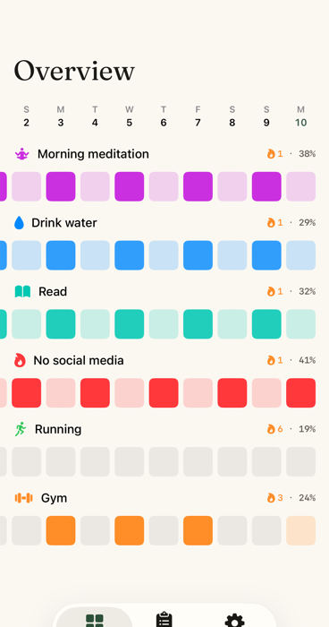
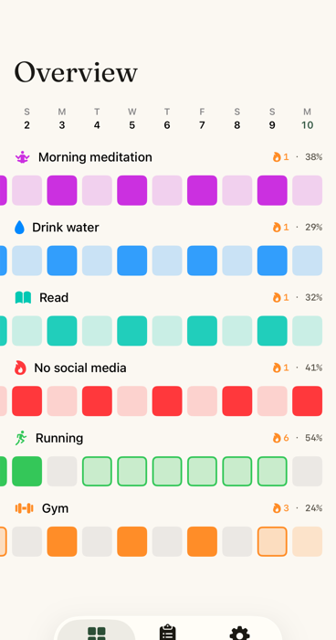

# Compound — Off-schedule completions & the two meanings of `isDue`

**Date**: 2026-08-10
**Status**: complete
**Research**: [research.md](./research.md) · **Plan**: [plan.md](./plan.md)
**Issue**: [#57](https://github.com/scastiel/kado/issues/57)

## What shipped

`FrequencyEvaluating` now asks two questions instead of one:

| | Question | Monotonic? | Consumers |
|---|---|---|---|
| `isDue` | Did the schedule ask for this day? | **Yes** — what is logged *on* the day never changes the answer | Overview grid, monthly calendar, score, streaks, Today sectioning, widget |
| `isOutstanding` | Does this still need doing *right now*? | No, deliberately | Reminder scheduling only |

They differ only for `.daysPerWeek`. Everything else follows from that split,
plus one ordering change: `OverviewMatrix.compute` resolves a day's
completions **before** falling back to the schedule.

## What the before/after actually shows

 

Same seed data, same habit order, same crop, captured on a dedicated
simulator. **Running** (`.daysPerWeek(5)`, 27 completions in 35 days) goes
from an entirely grey row scoring **19%** to **54%** with its completions
visible — one solid cell where the schedule asked for it, hollow cells for
the bonus days. **Gym** gains a hollow cell where an off-schedule completion
was previously indistinguishable from a rest day.

The four `.daily` habits are pixel-identical in both shots. That is the
control: the change cannot touch fixed schedules, and it doesn't.

## Lessons

### The issue's analysis was right, and incomplete in a way that mattered

Both reported causes reproduced exactly. But probing them turned up a third
symptom nobody had noticed: **a user who hits their five-per-week target
every single week had their habit score frozen at 19% forever.**
`scoreHistory` only folds a day into the EMA when `isDue` accepts it, and a
saturated rolling quota never accepts one. A perfect *daily* user scores 88%.

That reframed the whole fix. What arrived as "a grid renders one cell wrong"
was really "the core scoring loop is asking the wrong question," and the grid
was the visible corner of it. Worth remembering the next time an issue looks
cosmetic: the report is where the bug *surfaced*, not necessarily where it
*lives*.

### Verify with a probe, not by reading

The `TempIssue57Characterization` suite — four deliberately-failing tests
whose only job was to print real values into the log — took about five
minutes and produced the numbers above. Reading the source would have
confirmed the two reported causes and missed the score freeze entirely,
because the freeze is an emergent property of iterating `isDue` over 42 days,
not something visible at any single call site.

Cost: one `test_sim` cycle. Deleted before the first real commit.

### Duplication is the mechanism, not just a smell

Three copies of the frequency rules existed: the evaluator,
`MonthlyCalendarView.dayIsDue`, and `DefaultStreakCalculator.isDueByDay`. The
calendar copy is *why* the two surfaces could disagree — it treated
`.daysPerWeek` as always due and ignored `archivedAt`, so it drifted from the
shared evaluator without anything failing. Collapsing both into the injected
evaluator was a no-op for every existing test, which is the outcome you want:
the duplication was carrying no information, only risk.

### Default arguments can't reference other parameters — and fail silently

`WidgetSnapshotBuilder.build` took `calendar: Calendar = .current` alongside
`frequencyEvaluator: any FrequencyEvaluating = DefaultFrequencyEvaluator()`.
The second default pins itself to `Calendar.current` regardless of what the
caller passes for the first, so the builder honoured the caller's calendar
everywhere *except* inside its services. Existing tests never caught it
because they all used `.daily` habits, which are timezone-insensitive for
due-ness. A new `.specificDays` test failed with an off-by-one-day weekday
and exposed it.

The general shape: **when a function takes a value and also takes services
built from that value, resolve the services in the body, not in the default
argument.** Now spelled `= nil` and resolved from `calendar`.

### Simulator state is not trustworthy under contention

Roughly forty minutes went to chasing a "fix works / fix doesn't work"
flip-flop across successive launches of the same binary. The cause: another
process was installing a *different* Kado build (one carrying a "Day starts
at" setting that doesn't exist on this branch) into the shared simulator.
`get_app_container` returned a bundle path that no longer existed, while
`simctl listapps` pointed at a different UUID.

Signals that should have shortcut this:
- `get_app_container … app` returning a path that fails `ls` — the install DB
  and the filesystem disagree; stop and re-provision.
- A string on screen that `grep` cannot find anywhere in the repo. That is
  proof you are not running your build; it took one grep to settle it.

**Fix: create a dedicated simulator for the job** (`simctl create`) rather
than sharing the default device. Cheap, and it makes every subsequent capture
trustworthy. Doing this first would have saved the whole detour.

### Reaching a second tab headlessly

XcodeBuildMCP's tap primitives are still not enabled here (as
`CLAUDE.md` already records), and `idb`/`cliclick` aren't installed.
AppleScript `click at` against the Simulator window works but is fragile: the
coordinates need the window origin plus a ~52pt chrome offset, and **the
first click only focuses the window** — a second click is required to
actually land. Even then it silently missed often enough to be unreliable.

What worked deterministically: temporarily reorder `ContentView`'s tabs so
Overview is first, build, capture, then `git checkout HEAD --` the file. The
before-shot was captured the same way from the pre-fix commit, so the two
images are directly comparable. The tab bar was cropped from both since its
order is a capture artifact, not part of the change.

Verifying the app's own defaults also needed a detour: dev mode lives in the
App Group suite, so `simctl spawn … defaults write` writes to the wrong
domain. Writing the binary plist directly into
`…/Shared/AppGroup/<UUID>/Library/Preferences/` and killing `cfprefsd` works.

### The compiled `.lproj` is a free check on catalog keys

`Localizable.xcstrings` isn't auto-populated under `xcodebuild`, so new keys
are hand-authored — which means the key spelling is a guess about what the
compiler extracts. Grepping the *built* `Kado.app/en.lproj/Localizable.strings`
for the key confirms the guess in one command, and the `fr.lproj` copy
confirms the translation shipped. Both new keys resolved correctly.

## What the review round caught

`/code-review` found six things worth acting on. Three are worth remembering.

### A new visual state needs its own opacity floor, not the old one

`.offSchedule` reused `colorOpacity` for its border. That property's 0.2 floor
exists so a *missed* day stays visible against grey — a floor tuned for a
**fill**. Reused for a 2pt **border**, 0.2 alpha is nearly invisible, so
`.offSchedule(0.0)` — a negative habit's slip, which this PR's own test
asserts into existence — rendered *quieter* than the empty `.notDue` cell
beside it. The fix shipped the exact bug it was written to prevent, in the
one code path nobody looked at because the screenshots only ever showed
value-1 bonus days.

Lesson: when a new case borrows an existing derived property, check the
**extremes** of that property against the new rendering, not the typical
value. Screenshots show typical values by construction.

### Deduplication has a cost when the shared version is slower

Collapsing `DefaultStreakCalculator.isDueByDay` into the shared evaluator felt
like an unambiguous win — one source of truth, and every test stayed green.
But `DefaultFrequencyEvaluator` recomputes `habit.effectiveStart` (filter +
map + min over all completions) on every call, while the streak loops walk one
day at a time across a habit's whole lifetime. O(1) per day became
O(completions) per day: ~440k element visits per `best()` for a two-year
habit, on the main thread, from a SwiftUI computed property.

Tests can't see this. Reverted, and the explicit `.daysPerWeek → false` case
came back with it — it kept the "week-bucket path owns this frequency"
invariant enforced *at the point of use* rather than depending on both callers
switching first. The calendar dedup, which is what actually caused #57, stayed.

Lesson: "one source of truth" is a means, not the goal. Where the duplicate is
a cheap pure function and the shared version carries setup cost, keeping it —
with a comment saying why — beats the abstraction.

### Fixing a duplication by writing it a third time

The widget's "or logged today" arm was added by copy-pasting `TodayView`'s
workaround, in a PR whose own comments blame duplicated schedule rules for
#57. The copy also inherited a bug the original had: for a `.negative` habit a
record means the user *broke* it, and `HabitRowState` resolves that to
`.complete` — so a slip on an unscheduled day added a phantom row to the
widget and credited it. Hoisting the rule to `FrequencyEvaluating
.isDueOrLogged` fixed the bug once instead of twice.

Lesson: if a fix starts with "mirrors X", that comment is the signal to put it
next to X instead.

## Deliberate non-goals

- **Week-bucket scoring for `.daysPerWeek`.** Probably the right long-term
  model, but it reshapes the EMA and belongs with a `docs/habit-score.md`
  update.
- **The shortfall over-penalty.** A 2-day shortfall on a 5/week target costs
  4 missed days, because once the quota is unmet *every* remaining day stays
  due. Pre-existing, falls out of the rolling-window model.
- **Overview layout at Dynamic Type XXXL.** Verified during this work: the
  habit-name overlay overflows into the grid, because `labelsOverlay` uses a
  fixed `labelHeight` of 28pt against text that scales. Pre-existing and
  structural — the hollow cells themselves stay legible at XXXL and under
  Increase Contrast. Worth its own issue.
- **Same-day reminder suppression for completed habits of any frequency.**
  Real, but a behavior change unrelated to #57.
- **Solid-vs-hollow is order-dependent for `.daysPerWeek`.** Back-filling an
  earlier day can flip a later day from solid to hollow, because the rolling
  window that decides "was this day asked for" shifts. Inherent to the
  rolling-quota model rather than to this change — the same instability
  already governed which days scored at all. Would disappear under
  week-bucket scoring.
- **`completionPhrase` now exists three times** (`OverviewView`,
  `CellPopoverContent`, and inline in `MonthlyCalendarView`), differing only
  in capitalization. Consolidating means one helper in KadoCore plus two
  catalog key sets; left alone rather than widening this PR.
- **Composed VoiceOver labels are raw interpolations.**
  `"\(habit.name), \(dateString), \(state)"` never reaches the catalog, against
  CLAUDE.md's rule. Pre-existing in both `OverviewView` and
  `MonthlyCalendarView`; the fragments themselves are localized, only the
  comma-joining isn't.

## Verification

- 380 tests pass (`test_sim`), including new regressions for the matrix, the
  evaluator split, the score, the widget snapshot, the shared
  `isDueOrLogged` rule, and the off-schedule border floor.
- `build_sim` clean on iPhone 17 Pro and iPad Air 13-inch (M4).
- Overview captured before/after in light mode, plus dark mode and
  Dynamic Type XXXL with Increase Contrast.
- EN + FR translations verified present in the built bundle.
